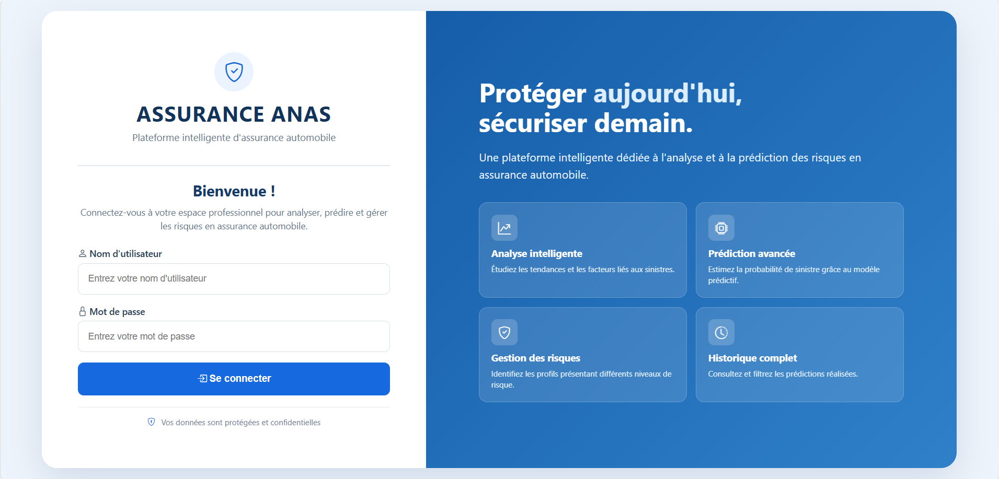
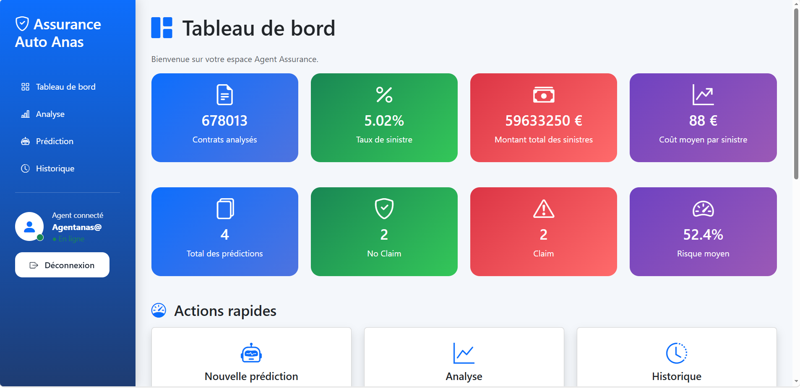
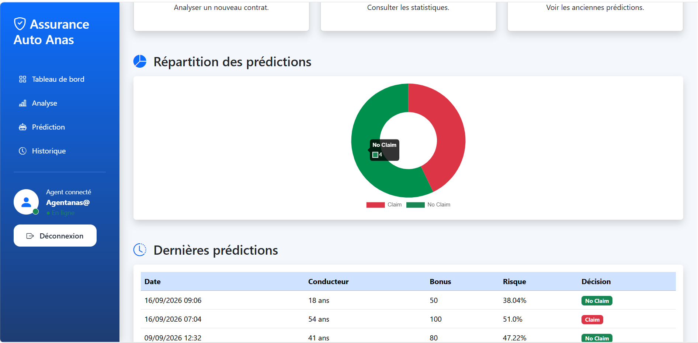
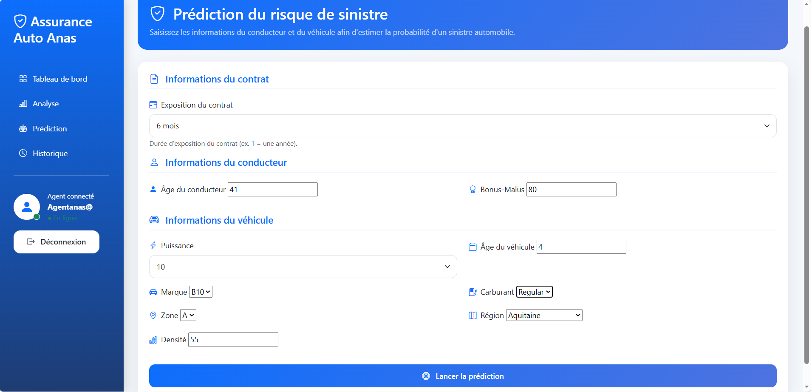
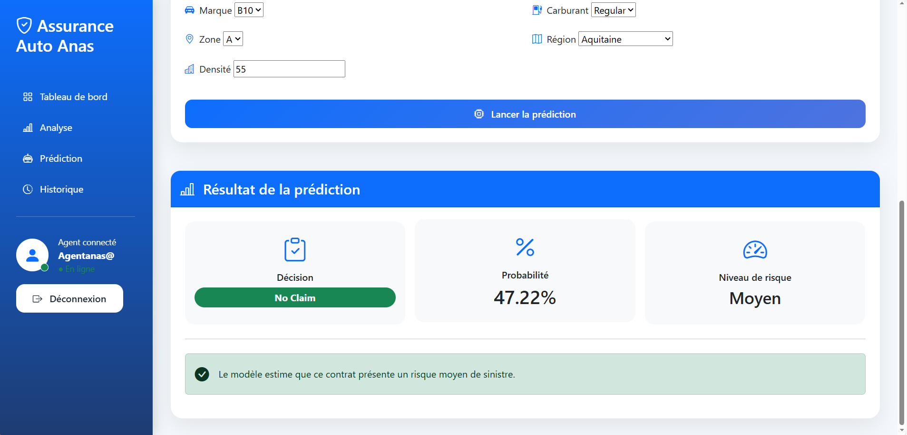
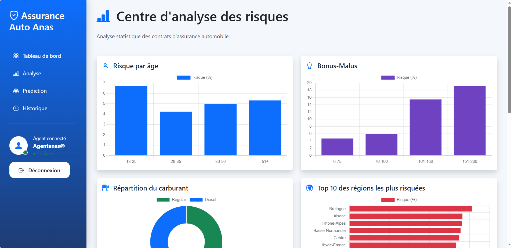
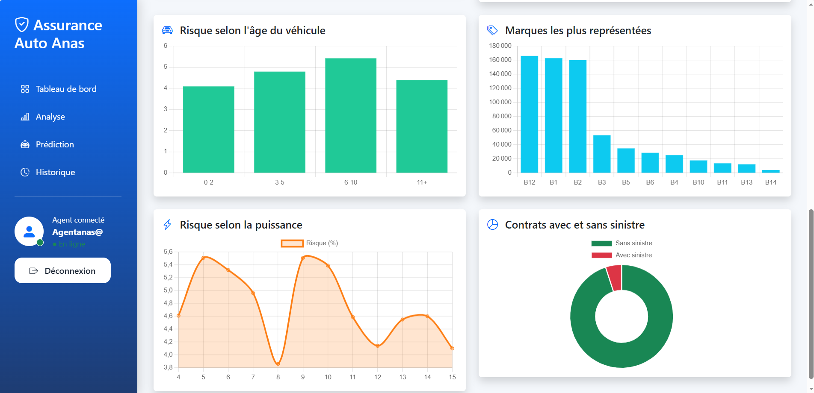
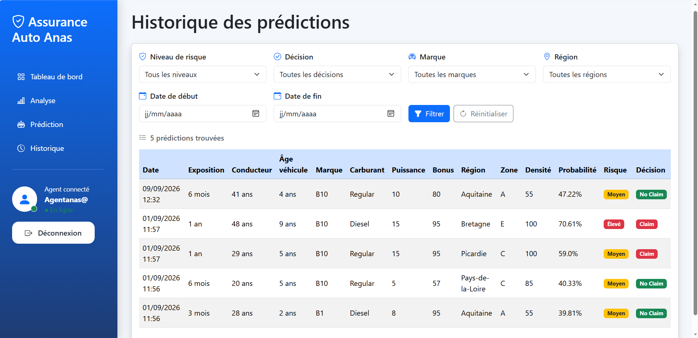

# Plateforme intelligente d'analyse et de prédiction des risques en assurance automobile

## Présentation

Ce projet consiste en la conception et le développement d'une plateforme intelligente dédiée à l'analyse et à la prédiction des risques en assurance automobile.

Réalisé dans le cadre d'un stage chez **WAFA Assurance**, le projet combine une démarche de **Data Science et de Machine Learning** avec le développement d'une **application web Django**.

L'objectif principal est de permettre à un Agent Assurance d'analyser les caractéristiques des contrats automobiles, d'étudier les facteurs associés aux sinistres et d'obtenir une estimation de la probabilité qu'un contrat soit associé à un sinistre.

Le projet s'appuie sur le dataset **freMTPL2 - French Motor Third Party Liability Insurance Claims Data**, contenant 678 013 contrats d'assurance automobile et 26 639 sinistres.

---

## Problématique

L'assurance automobile génère un volume important de données relatives aux conducteurs, aux véhicules et aux contrats.

La problématique étudiée dans ce projet est la suivante :

> **Comment prédire, à partir des caractéristiques historiques d'un contrat d'assurance automobile, la probabilité qu'il soit associé à un sinistre et intégrer cette prédiction dans un outil utilisable par un Agent Assurance ?**

Pour répondre à cette problématique, une démarche complète de Data Science a été mise en place, depuis l'audit et le nettoyage des données jusqu'à l'intégration du modèle de Machine Learning dans une plateforme web.

---

## Objectifs

Les principaux objectifs du projet sont :

- auditer et explorer les données d'assurance automobile ;
- nettoyer et préparer les données ;
- analyser les facteurs associés à la fréquence des sinistres ;
- réaliser le Feature Engineering nécessaire à la modélisation ;
- entraîner et comparer plusieurs modèles de Machine Learning ;
- gérer le déséquilibre entre les classes `Claim` et `No Claim` ;
- optimiser le modèle retenu à l'aide d'une recherche d'hyperparamètres ;
- intégrer le modèle final dans une application Django ;
- fournir à l'Agent Assurance une interface permettant d'analyser les données et d'effectuer des prédictions ;
- conserver l'historique des prédictions réalisées.

---

## Données utilisées

Le projet utilise le dataset :

**freMTPL2 - French Motor Third Party Liability Insurance Claims Data**

Deux sources principales sont utilisées :

```text
freMTPL2freq.csv
freMTPL2sev.csv
```
## Technologies utilisées

### Data Science et Machine Learning

- Python
- Pandas
- NumPy
- Scikit-learn
- Matplotlib
- Seaborn
- Jupyter Notebook

### Développement web

- Django
- HTML
- CSS
- JavaScript
- Chart.js
- Bootstrap / Bootstrap Icons

### Base de données

- SQLite

### Gestion du projet

- Git
- GitHub
- Visual Studio Code


## Aperçu de la plateforme

### Page de connexion



### Tableau de bord





### Prédiction du risque





### Analyse statistique





### Historique des prédictions

